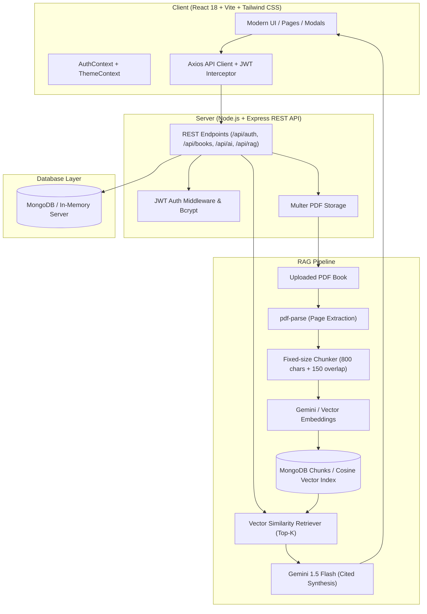

# CurateNest — AI-Powered Smart Reading & Book Management Platform

[](https://opensource.org/licenses/MIT)
[](#technology-stack)
[](#rag-pipeline-architecture)

> **"Organize your books. Track your journey. Discover more."**

CurateNest is a modern, end-to-end digital reading ecosystem that unites personal library curation, progress tracking, analytics, AI-assisted comprehension (summaries, chapter breakdowns, discussion guides), personalized mood-based recommendations, and conversational document retrieval (**RAG**) on uploaded PDF books.

---

## 🌟 Problem Statement & Vision

Traditional reading apps are either basic spreadsheet-style book lists or isolated reading apps that lack intelligence. Readers often:
1. Lose momentum and fail to maintain consistent reading habits.
2. Forget key mental models, chapters, and takeaways shortly after finishing a book.
3. Struggle to locate specific quotes, sections, or answers buried inside long non-fiction books or study PDFs.

**CurateNest bridges this gap** by converting your reading library into an interactive, active knowledge base through Google Gemini and Retrieval-Augmented Generation (RAG).

```
Library  ──►  Reading Progress  ──►  Insights  ──►  AI Assistance  ──►  Chat With Books (RAG)
```

---

## ✨ Features

### 1. 📚 Personal Digital Library
* **Catalog Management**: Add, edit, filter, search, and delete books across statuses: `Currently Reading`, `Completed`, `Wishlist`, and `Paused`.
* **Rich Metadata**: Book covers, formats (Hardcover, Paperback, E-book, Audiobook), page counts, ratings (1–5 stars), genres, and custom tags.
* **Smart Filtering & Sorting**: Filter by status and genre; sort by recently updated, rating, progress %, or title.
* **Dual View Modes**: Switch seamlessly between responsive card grid and dense table views.

### 2. 📈 Reading Progress & Momentum Tracking
* **Automatic Progress Calculation**: Calculates completion percentage, pages remaining, and start/finish dates.
* **Fast Progress Modal**: Quick increment buttons (`+10`, `+25`, `+50`, `Finish Book`) and reading session duration logging.
* **Streak & Activity History**: Records daily reading logs to compute current streaks and volume velocity.

### 3. 🧠 AI Book Assistant (Google Gemini)
* **Instant Summaries**: Core thesis, context, and bulleted takeaways for any book.
* **Chapter Breakdowns**: Section-by-section analysis highlighting key insights.
* **Mental Models**: Extraction of core frameworks and cognitive tools.
* **Discussion Guides**: Reflection questions for book clubs and self-study.
* **Conversational AI**: Chat directly with an AI assistant contextualized to your book.

### 4. 📄 Chat With Your Books (RAG Pipeline)
* **PDF Book Ingestion**: Upload study PDFs, book chapters, or papers up to 50MB.
* **Document Chunking & Embeddings**: Automatically parses PDF text, breaks it into fixed-size overlapping chunks, and generates vector embeddings.
* **Custom Vector Retrieval**: Stores document chunks with their embeddings and uses an in-memory cache plus cosine-similarity retrieval.
* **Cited Answers**: Answers user questions referencing exact document pages and contextual snippets.

### 5. 🎯 Smart AI Recommendations
* **Context-Aware Suggestions**: Curated based on user reading history, favorite genres, and interests.
* **Mood-Based Exploration**:
  * 🔥 *Motivational*
  * ☕ *Relaxing & Cozy*
  * 🔍 *Mystery & Thriller*
  * 🎓 *Deep Learning / Educational*
  * ❤️ *Emotional & Moving*
* **One-Click Wishlist**: Add recommended books directly to your wishlist queue.

### 6. 📊 Reading Insights & Goals
* **Visual Analytics (Recharts)**:
  * Books completed per month (Bar chart)
  * Daily reading volume velocity (Area chart)
  * Genre distribution (Donut chart)
  * Most-read authors ranking
* **Goal Setting**: Track annual book challenges with visual completion bars and remaining book countdowns.

### 7. 📝 Notes, Quotes & Reviews Hub
* Save personal notes, verbatim quotes, chapter highlights, and detailed reviews.
* Filter and search across your thoughts with page citations.

---

## 🏗️ Architecture & RAG Pipeline



---

## 💻 Technology Stack

| Layer | Technologies |
| :--- | :--- |
| **Frontend** | React 18, Vite, Tailwind CSS, React Router v6, Axios, Recharts, Lucide React |
| **Backend** | Node.js, Express.js, REST APIs |
| **Database** | MongoDB, Mongoose *(with automatic in-memory fallback via mongodb-memory-server)* |
| **Authentication** | JSON Web Tokens (JWT), bcryptjs password hashing |
| **AI & RAG** | Google Gemini API (`@google/generative-ai`), Gemini Embeddings, custom cosine-similarity retrieval, pdf-parse |

---

## 📁 Project Structure

```
curatenest/
├── package.json               # Root scripts for concurrently running client & server
├── .env.example               # Environment variables template
├── .env                       # Local environment variables
├── .gitignore
├── README.md                  # System documentation
│
├── server/                    # Express Backend
│   ├── package.json
│   ├── server.js              # Server entrypoint & middleware
│   ├── config/
│   │   └── db.js              # Database connection with in-memory fallback
│   ├── models/
│   │   ├── User.js            # User profile & preferences
│   │   ├── Book.js            # Book catalog & virtual progress %
│   │   ├── ReadingHistory.js  # Reading activity logs for streak & analytics
│   │   ├── ReadingGoal.js     # Annual challenges & milestone tracking
│   │   ├── Note.js            # Notes, quotes, highlights, and reviews
│   │   └── UploadedBook.js    # Ingested PDF documents & vector chunks
│   ├── middleware/
│   │   ├── auth.js            # JWT bearer token verification
│   │   └── upload.js          # Multer PDF upload configuration
│   ├── controllers/
│   │   ├── authController.js
│   │   ├── bookController.js
│   │   ├── progressController.js
│   │   ├── goalController.js
│   │   ├── noteController.js
│   │   ├── aiController.js
│   │   └── ragController.js
│   ├── routes/
│   │   ├── auth.js
│   │   ├── books.js
│   │   ├── progress.js
│   │   ├── goals.js
│   │   ├── notes.js
│   │   ├── ai.js
│   │   └── rag.js
│   ├── services/
│   │   ├── geminiService.js   # Gemini summaries, recommendations, & chat
│   │   ├── ragService.js      # PDF extraction, chunking, embeddings & cosine search
│   │   └── seedService.js     # Realistic demo library seeder
│   └── uploads/               # Temporary PDF document storage
│
└── client/                    # Vite + React Frontend
    ├── package.json
    ├── vite.config.js         # Port configuration & backend proxy (/api)
    ├── tailwind.config.js     # Custom theme palette (Indigo, Emerald, Slate)
    ├── index.html
    └── src/
        ├── App.jsx            # Application router & route guards
        ├── main.jsx           # React DOM root
        ├── index.css          # Tailwind base & custom scrollbars
        ├── context/
        │   ├── AuthContext.jsx   # User authentication state
        │   └── ThemeContext.jsx  # Dark/Light mode manager
        ├── services/
        │   └── api.js         # Axios client with JWT interceptor
        ├── layouts/
        │   └── MainLayout.jsx # Collapsible sidebar + top navigation header
        ├── components/
        │   ├── Navbar.jsx
        │   ├── Sidebar.jsx
        │   ├── BookCard.jsx
        │   ├── ProgressModal.jsx
        │   ├── StatCard.jsx
        │   ├── SkeletonLoader.jsx
        │   └── Toast.jsx
        └── pages/
            ├── LandingPage.jsx      # Public presentation & feature overview
            ├── Login.jsx            # Login with 1-click demo credential autofill
            ├── Register.jsx         # Sign up with genre selection & auto-seed
            ├── Dashboard.jsx        # Stat cards, Recharts velocity, continue reading
            ├── MyLibrary.jsx        # Book CRUD, search, status tabs, sort
            ├── BookDetails.jsx      # Progress tracker, notes, synopsis, AI shortcuts
            ├── BookForm.jsx         # Add/Edit book with cover preview presets
            ├── CurrentlyReading.jsx # Active reading queue
            ├── Wishlist.jsx         # Saved titles with "Start Reading" action
            ├── AiAssistant.jsx      # Gemini summary, chapter breakdown, chat
            ├── RagChat.jsx          # PDF ingestion & cited document question answering
            ├── Recommendations.jsx  # AI recommendations & mood filters
            ├── ReadingInsights.jsx  # Analytics (Monthly, velocity, genres, authors)
            ├── ReadingGoals.jsx     # Targets, challenges, and completion bars
            ├── NotesReviews.jsx     # Quotes, reflections, and highlights
            └── Settings.jsx         # Profile preferences, system health, demo seeder
```

---

## 🚀 Quick Start Guide

### Prerequisites
* **Node.js**: v18.0.0 or higher
* **NPM**: v9.0.0 or higher
* *(Optional)* MongoDB URI & Google Gemini API Key

### 1. Installation

From the root directory:
```bash
# Install root, backend, and frontend dependencies
npm run install:all
```

Or install individually:
```bash
cd server && npm install
cd ../client && npm install
```

### 2. Environment Configuration

Create a `.env` file in the root or `server/` directory (a pre-configured template is available in `.env.example`):
```env
PORT=5000
MONGO_URI=
JWT_SECRET=curatenest_super_secret_jwt_key_2026
GEMINI_API_KEY=your_gemini_api_key_here
```

> **Note:**
> - If `MONGO_URI` is left blank, CurateNest automatically initializes an in-memory MongoDB instance (`mongodb-memory-server`) with zero manual setup.
> - If `GEMINI_API_KEY` is not provided, CurateNest operates in intelligent offline demo mode, ensuring that the app remains 100% stable, responsive, and testable without crashing.

### 3. Running the Application

**Option A: Run Both Services Concurrently**
```bash
npm run dev
```

**Option B: Run Individually**
Terminal 1 (Backend API):
```bash
cd server
npm run dev
```
*Backend runs on `http://localhost:5000`*

Terminal 2 (Frontend Client):
```bash
cd client
npm run dev
```
*Frontend runs on `http://localhost:5173`*

Open **http://localhost:5173** in your browser!

---

## 🧪 Demo Experience

1. **Instant Sign In**: On the `/login` page, click **"Click here to autofill demo credentials"** to test with `reader@curatenest.ai` / `curate123`.
2. **Auto-Populated Library**: When a new account is registered or created, CurateNest automatically seeds sample bestsellers (*Atomic Habits*, *Deep Work*, *Thinking, Fast and Slow*, *Dune*, etc.) along with 14 days of reading logs so all Recharts graphs illuminate immediately.
3. **One-Click Re-seed**: At any time, click **"Load Sample Books"** in the Dashboard or Settings to reset and inspect realistic demo data.

---

## 🔒 Security & Best Practices

* **No Hardcoded Keys**: All secrets and API credentials reside strictly in environment variables.
* **Hashed Passwords**: User passwords hashed using bcrypt with salt rounds.
* **Route Protection**: JWT authentication header validation on all protected REST endpoints.
* **Safe Error Handling**: Server errors return standard JSON responses and never expose internal stack traces in production.

---

## 📄 License

CurateNest is open-source software licensed under the [MIT License](LICENSE).
